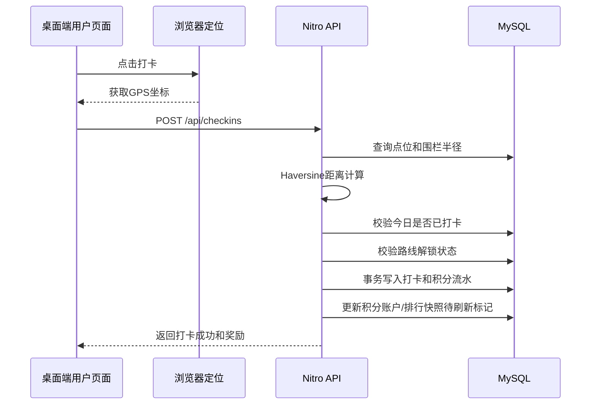
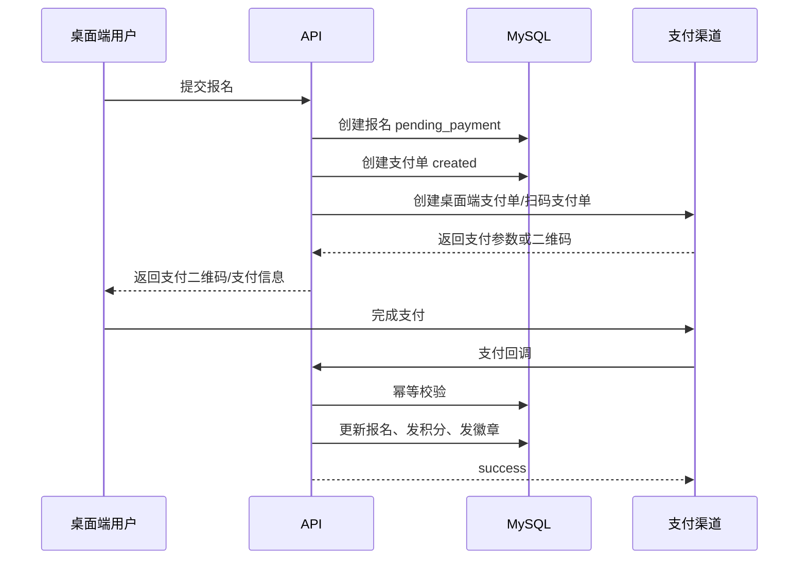
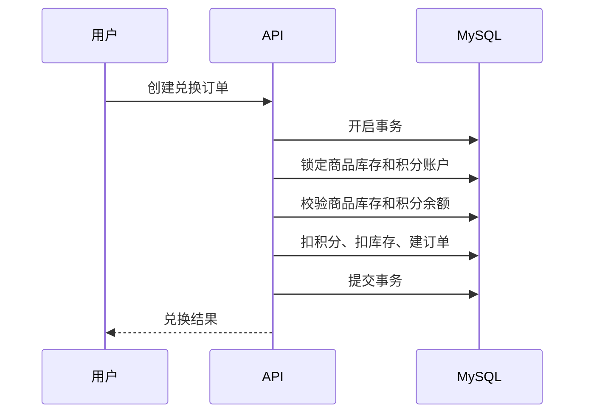

# 318/行鉴需求结合当前项目的开发思考

> 输入需求文档：`docs/318-行鉴项目开发文档-v3.md`  
> 当前项目：`nuxt-interaction`  
> 生成时间：2026-07-14  
> 本次约束：**继续使用 MySQL；保持当前桌面端视觉与交互风格，不做移动端适配。**

---

## 1. 总体判断

当前项目是一个基于 **Nuxt 4 + Vue 3 + Pinia + Element Plus + MySQL** 的饮品商城交互演示项目，已经具备：

- Nuxt 4 全栈同仓结构；
- 前台页面、后台 dashboard、服务端 API、service 层雏形；
- 商品管理、订单扣库存、地图标注、登录注册、审计日志；
- Dify/Page Agent/幽灵手等 AI 页面自动化能力；
- VOID 风格桌面端视觉系统和后台桌面端管理体验。

行鉴需求是一个 **多城市线下打卡 + 活动报名支付 + 好友社交 + 积分商城 + 后台管理** 的综合服务平台。结合新的开发约束，本项目不做数据库技术栈迁移，也不切移动端 H5 方向，而是在现有基础上继续采用：

- **Nuxt 4 全栈一体化**；
- **MySQL 作为主数据库**；
- **桌面端 Web 页面与 VOID/Element Plus 风格**；
- **Nitro API + Service + MySQL 事务** 的业务实现方式。

推荐路线：

> **保留当前工程骨架、桌面端视觉、后台雏形、地图标注经验、商品/订单事务经验、审计日志能力；在 MySQL 上重建行鉴业务领域模型，按“城市点位打卡 → 积分账户 → 活动支付 → 积分商城 → 社交排行”的顺序分阶段开发。**

---

## 2. 当前项目与行鉴需求的匹配度

| 行鉴需求模块 | 优先级 | 当前项目覆盖度 | 开发判断 |
| --- | --- | --- | --- |
| 打卡系统 | P0 | 低，仅有地图标注 | 新建点位、围栏、打卡、积分发放模型 |
| 多城市扩展 | P0 | 无 | 作为基础维度优先建设 |
| 活动报名 | P0 | 无 | 新建活动、报名、支付状态机 |
| 微信/线上支付 | P0 | 无，当前是模拟支付 | 桌面端优先考虑扫码支付或 PC 浏览器适配支付流程 |
| 积分/徽章 | P0 | 无 | 新建积分账户、流水、徽章发放体系 |
| 好友管理 | P0 | 无 | 新建好友申请、好友关系、二维码能力 |
| 积分商城 | P0 | 中，商品/库存思路可复用 | 将饮品商城改造为积分兑换商城 |
| 后台管理 | P0 | 中，有 dashboard、商品管理、地图、审计 | 扩展为行鉴运营后台 |
| 排行榜 | P1/P2 | 无 | 优先用 MySQL 汇总表/索引查询实现，后续按规模优化 |
| 团队 | P1/P2 | 无 | 好友体系稳定后开发 |
| 行鉴成果 | 后续 | 无 | 先预留数据结构，不进入 v1 核心链路 |

---

## 3. 当前项目可复用资产

### 3.1 工程结构

当前项目已经是 Nuxt 全栈结构：

- `app/pages`：页面；
- `app/components`：组件；
- `app/composables`：前端业务组合函数；
- `app/stores`：Pinia；
- `server/api`：Nitro API；
- `server/services`：服务层；
- `server/utils`：工具；
- `server/sql`：初始化 SQL。

这一结构可以继续沿用，不需要重开项目。

### 3.2 桌面端视觉与交互

当前项目已经形成了较完整的 VOID 桌面端风格：

- 首页沉浸式视觉；
- `VoidShell` 页面外壳；
- 暗色、网格、噪点、扫描线等统一视觉；
- 后台 dashboard 桌面端布局；
- Element Plus 表格、表单、弹窗等管理端交互。

行鉴项目在当前约束下应继续保持桌面端风格：

- 前台用户页面可继续使用 VOID 风格；
- 后台继续使用 Element Plus + dashboard layout；
- 不做移动端专门适配；
- 可以保留大屏/桌面端的地图、横向卡片、沉浸式展示等交互优势。

### 3.3 后台管理雏形

当前 `/dashboard` 已有：

- dashboard layout；
- 商品管理；
- 地图标注；
- 审计日志；
- 登录态校验。

这些可作为行鉴后台基础：

- 商品管理 → 积分商城商品管理；
- 地图标注 → 点位管理/点位地图标注；
- 审计日志 → 后台所有关键操作审计；
- dashboard layout → 城市、点位、活动、商品、用户、订单、团队等菜单。

### 3.4 地图标注经验

当前 `app/pages/dashboard/map.vue` 已有高德地图加载、搜索、标注、保存、列表展示等能力。行鉴点位管理可以复用交互思路，但数据模型要从 `addresses` 改为：

- 城市；
- 点位名称；
- 点位类型；
- 经纬度；
- 围栏半径；
- 图文介绍；
- 上下架状态；
- 路线归属。

### 3.5 商品和库存事务经验

当前 `server/api/orders/checkout.post.ts` 已经有事务扣库存思路：

- 查询商品；
- 校验库存；
- `SELECT ... FOR UPDATE`；
- 扣库存；
- 提交事务。

积分商城兑换也需要类似能力，但要改为：

- 校验积分；
- 扣积分；
- 写积分流水；
- 扣库存；
- 生成兑换订单；
- 实物/虚拟商品发货状态。

### 3.6 审计日志

当前 `server/services/audit.service.ts` 已经实现了记录操作人、资源类型、资源 ID、描述、metadata、requestId、IP 的能力。后续建议扩展为后台通用审计能力，覆盖：

- 城市管理；
- 点位管理；
- 活动管理；
- 商品管理；
- 用户状态变更；
- 积分人工调整；
- 订单发货/退款；
- 权限变更。

---

## 4. 技术路线调整

### 4.1 继续使用 MySQL

本项目不再规划迁移到其他数据库，继续沿用 MySQL。

建议改造方向：

- 保留 `mysql2/promise` 或在其上封装 repository 层；
- 将当前硬编码连接信息改为环境变量；
- 为行鉴业务新建 SQL 初始化/迁移脚本；
- 使用 InnoDB 事务、行级锁、唯一索引、条件更新处理并发；
- 用合理索引和统计表支撑排行榜与运营报表。

可选增强：

| 方案 | 说明 | 建议 |
| --- | --- | --- |
| 继续 `mysql2` + 手写 SQL | 与当前项目一致，改造成本低 | 推荐短期使用 |
| 引入 Knex | 保留 SQL 控制力，迁移管理更清晰 | 中期可评估 |
| 引入 Prisma + MySQL | 类型友好，但会改变当前数据访问习惯 | 若团队希望类型化可选 |

### 4.2 暂不引入额外缓存中间件

在当前需求约束下，排行榜、库存并发和常用配置优先使用 MySQL 实现：

- 排行榜：积分账户表 + 排行榜快照表 + 定时汇总；
- 高并发兑换：MySQL 事务、`SELECT ... FOR UPDATE`、库存条件更新；
- 幂等：唯一索引和业务流水号；
- 缓存：可先使用服务端内存短缓存或 MySQL 配置表。

如果后续并发量明显增长，再评估引入专用缓存或队列组件。

### 4.3 用户体系重构

当前只有简单用户名密码登录。行鉴需要：

- C 端用户；
- 手机号；
- 昵称、头像；
- 积分账户；
- 等级；
- 徽章；
- 状态管理；
- 好友关系；
- 二维码加好友；
- 后台管理员；
- 角色权限。

建议区分：

- `users`：C 端用户；
- `admin_users`：后台管理员；
- `roles` / `permissions`：后台权限。

### 4.4 保持桌面端页面

当前前台和后台均偏桌面端体验。根据新约束：

- 不做移动端专项适配；
- 不把页面改成移动 H5；
- 保持 VOID 风格和桌面端布局；
- 支付流程优先考虑桌面端可用方式，例如扫码支付；
- 地图、点位、活动、商城页面均以桌面 Web 体验设计。

---

## 5. 推荐业务数据模型（MySQL）

### 5.1 城市、点位、路线、打卡

| 表 | 说明 | 关键字段 |
| --- | --- | --- |
| `cities` | 城市 | id、name、code、status、sort_order |
| `poi_points` | 点位 | id、city_id、name、type、lng、lat、fence_radius、cover_url、description、status |
| `routes` | 路线 | id、city_id、name、description、status |
| `route_points` | 路线点位顺序 | route_id、point_id、sort_order、is_start、is_end |
| `checkins` | 打卡记录 | user_id、city_id、point_id、route_id、distance、photo_url、checked_at、checkin_date |
| `user_route_progress` | 用户路线进度 | user_id、route_id、current_point_id、status、completed_at |

关键约束：

- 同一点位每日限打一次：`UNIQUE KEY uk_user_point_date (user_id, point_id, checkin_date)`；
- 经纬度使用 `DECIMAL(10, 7)` 或更高精度；
- 围栏校验服务端使用 Haversine 公式；
- 路线解锁通过 `route_points.sort_order` 与用户打卡记录判断。

### 5.2 积分和徽章

| 表 | 说明 | 关键字段 |
| --- | --- | --- |
| `points_accounts` | 积分账户 | user_id、balance、total_earned、total_spent |
| `points_ledger` | 积分流水 | user_id、change_value、scene、ref_type、ref_id、balance_after |
| `badges` | 徽章定义 | name、icon_url、description、status |
| `user_badges` | 用户徽章 | user_id、badge_id、source_type、source_id、granted_at |
| `member_levels` | 会员等级 | name、min_points、benefits |
| `ranking_snapshots` | 排行榜快照 | scope、period、user_id、rank_no、points、generated_at |

原则：

- 不要只更新用户积分余额，必须写积分流水；
- 积分变化必须在 MySQL 事务里；
- 打卡、活动、兑换、人工调整都使用统一积分服务；
- 通过 `scene + ref_type + ref_id` 唯一约束保证发放幂等；
- 排行榜优先通过账户表排序或快照表实现。

### 5.3 活动和支付

| 表 | 说明 | 关键字段 |
| --- | --- | --- |
| `activities` | 活动 | city_id、title、price、quota、registered_count、start_at、end_at、status、reward_points、badge_id |
| `activity_registrations` | 报名 | activity_id、user_id、status、form_data、amount、paid_at |
| `payments` | 支付单 | biz_type、biz_id、user_id、amount、channel、out_trade_no、transaction_id、status |
| `payment_callbacks` | 回调记录 | payment_id、raw_payload、received_at |

支付成功后事务：

1. 校验回调签名；
2. 幂等检查支付单状态；
3. 更新支付单为 paid；
4. 更新报名为 paid；
5. 发放积分；
6. 发放徽章；
7. 写审计/事件日志。

桌面端支付建议：

- 若使用微信支付，优先评估扫码支付；
- 支付完成页只能查询服务端支付状态，不能以前端跳转作为成功依据；
- 支付回调要用唯一订单号和状态字段保证幂等。

### 5.4 好友、团队、排行

| 表 | 说明 | 关键字段 |
| --- | --- | --- |
| `friend_requests` | 好友申请 | from_user_id、to_user_id、status、message |
| `friendships` | 好友关系 | user_id、friend_user_id、created_at |
| `teams` | 团队 | name、owner_user_id、city_id、status |
| `team_members` | 团队成员 | team_id、user_id、role、joined_at |
| `team_ranking_snapshots` | 团队排行快照 | period、team_id、rank_no、points、generated_at |

排行榜实现建议：

- 世界排行：基于 `points_accounts.total_earned` 或 `balance` 排序；
- 好友排行：查询好友 ID 集合后按积分排序；
- 团队排行：定时汇总团队成员积分到快照表；
- 月榜：通过 `points_ledger` 按月份聚合生成快照。

### 5.5 积分商城

| 表 | 说明 | 关键字段 |
| --- | --- | --- |
| `mall_products` | 积分商品 | name、type、points_price、stock、cover_url、description、status |
| `mall_product_stock_logs` | 库存日志 | product_id、change_value、reason、operator_id |
| `exchange_orders` | 兑换订单 | order_no、user_id、product_id、points_amount、status、receiver_info、logistics_no |
| `virtual_codes` | 虚拟商品兑换码 | product_id、code、status、assigned_order_id |

兑换流程：

1. 校验商品上架；
2. 开启 MySQL 事务；
3. `SELECT ... FOR UPDATE` 锁商品和积分账户；
4. 校验库存和积分余额；
5. 扣积分并写流水；
6. 扣库存并写库存日志；
7. 创建兑换订单；
8. 提交事务。

---

## 6. 关键业务流程

### 6.1 打卡流程

### 6.2 活动报名支付流程

### 6.3 积分兑换流程

---

## 7. 页面规划

### 7.1 C 端桌面 Web 页面

| 路由 | 页面 | 说明 |
| --- | --- | --- |
| `/` | 城市首页 | 当前城市、热门点位、活动入口，延续 VOID 风格 |
| `/cities` | 城市切换 | 多城市基础 |
| `/checkins` | 点位列表 | 点位卡片、地图联动、可打卡状态 |
| `/checkins/[id]` | 点位详情 | 图文介绍、桌面端地图、打卡按钮 |
| `/routes/[id]` | 路线详情 | 起点/终点、进度、解锁状态 |
| `/footprints` | 个人足迹 | 时间线/地图模式，P1 |
| `/activities` | 活动列表 | 城市/时间筛选 |
| `/activities/[id]` | 活动详情 | 报名和支付 |
| `/mall` | 积分商城 | 商品列表 |
| `/mall/[id]` | 商品详情 | 积分兑换 |
| `/orders` | 兑换记录 | P1 |
| `/friends` | 好友 | 好友申请、扫码、列表 |
| `/rankings` | 排行榜 | 世界/好友/团队 |
| `/profile` | 我的 | 积分、徽章、订单、设置 |

### 7.2 后台管理页面

| 路由 | 页面 | 当前项目复用点 |
| --- | --- | --- |
| `/dashboard` | 数据概览 | 复用 dashboard layout |
| `/dashboard/cities` | 城市管理 | 新建 |
| `/dashboard/points` | 点位列表 | 从地址管理演进 |
| `/dashboard/points/map` | 点位地图标注 | 复用 map 页面思路 |
| `/dashboard/routes` | 路线管理 | 新建 |
| `/dashboard/activities` | 活动管理 | 新建 |
| `/dashboard/mall-products` | 积分商品管理 | 改造现有商品管理 |
| `/dashboard/users` | 用户管理 | 新建 |
| `/dashboard/orders` | 订单管理 | 新建 |
| `/dashboard/teams` | 团队管理 | P1 新建 |
| `/dashboard/audit-logs` | 操作日志 | 复用现有审计日志 |
| `/dashboard/settings` | 系统配置 | 积分规则、围栏默认值等 |

---

## 8. API 草案

### 8.1 城市、点位、打卡

| Method | Path | 说明 |
| --- | --- | --- |
| GET | `/api/cities` | 城市列表 |
| GET | `/api/points` | 点位列表 |
| GET | `/api/points/:id` | 点位详情 |
| POST | `/api/checkins` | 用户打卡 |
| GET | `/api/me/checkins` | 我的打卡记录 |
| POST | `/api/admin/cities` | 新增城市 |
| PUT | `/api/admin/cities/:id` | 编辑城市 |
| POST | `/api/admin/points` | 新增点位 |
| PUT | `/api/admin/points/:id` | 编辑点位 |
| POST | `/api/admin/points/import` | 批量导入点位 |

### 8.2 活动和支付

| Method | Path | 说明 |
| --- | --- | --- |
| GET | `/api/activities` | 活动列表 |
| GET | `/api/activities/:id` | 活动详情 |
| POST | `/api/activities/:id/register` | 创建报名 |
| POST | `/api/payments/mock/:id/confirm` | 第一阶段确认模拟支付；后续接入真实桌面端扫码支付时替换渠道适配器 |
| POST | `/api/payments/wechat/notify` | 真实支付阶段预留的微信支付回调 |
| GET | `/api/me/activity-registrations` | 我的报名记录 |

### 8.3 积分商城

| Method | Path | 说明 |
| --- | --- | --- |
| GET | `/api/mall/products` | 商品列表 |
| GET | `/api/mall/products/:id` | 商品详情 |
| POST | `/api/mall/orders` | 创建兑换订单 |
| GET | `/api/me/exchange-orders` | 我的兑换记录 |
| POST | `/api/admin/mall-products` | 后台新增商品 |
| PUT | `/api/admin/mall-products/:id` | 后台编辑商品 |
| POST | `/api/admin/orders/:id/ship` | 发货 |

### 8.4 好友和排行

| Method | Path | 说明 |
| --- | --- | --- |
| GET | `/api/friends` | 好友列表 |
| POST | `/api/friend-requests` | 发起好友申请 |
| POST | `/api/friend-requests/:id/accept` | 同意申请 |
| POST | `/api/friend-requests/:id/reject` | 拒绝申请 |
| GET | `/api/rankings/global` | 世界排行 |
| GET | `/api/rankings/friends` | 好友排行 |
| GET | `/api/rankings/teams` | 团队排行 |

---

## 9. 分阶段开发建议

### 阶段 0：MySQL 技术底座整理

目标：让当前项目转为行鉴可持续开发底座。

任务：

- MySQL 连接配置环境变量化；
- 建立行鉴业务 SQL/migration 管理方式；
- C 端用户与后台管理员拆分；
- JWT secret、DB、支付配置环境变量化；
- RBAC 权限模型；
- 统一错误码和响应结构；
- 审计日志泛化；
- 桌面端前台 layout 与后台 layout 规划。

### 阶段 1：城市 + 点位 + 打卡闭环

目标：完成行鉴最核心的线下探索闭环。

任务：

- 城市管理；
- 点位管理；
- 点位地图标注；
- 桌面端点位列表/详情；
- 浏览器定位授权；
- 服务端围栏校验；
- 打卡记录；
- 打卡发积分；
- 每日限打一次。

建议先完成单点打卡闭环，路线起终点解锁可作为阶段 1.5。

### 阶段 2：积分账户 + 徽章 + 排行基础

任务：

- 积分账户；
- 积分流水；
- 积分规则配置；
- 徽章定义和发放；
- MySQL 排行榜快照表；
- 个人中心积分/徽章展示。

### 阶段 3：活动报名 + 桌面端支付

任务：

- 活动后台 CRUD；
- 活动前台列表/详情；
- 报名表单；
- 桌面端支付流程；
- 支付回调；
- 报名状态；
- 支付成功奖励发放；
- 活动统计。

支付模块建议先 mock 跑通状态机，同时并行准备支付渠道资料和回调域名。

### 阶段 4：积分商城

任务：

- 积分商品管理；
- 商城前台；
- 积分兑换订单；
- MySQL 事务防超兑；
- 实物发货；
- 虚拟商品自动发货预留；
- 兑换记录。

### 阶段 5：好友、团队、排行榜增强

任务：

- 手机号搜索好友；
- 二维码加好友；
- 好友申请；
- 好友排行；
- 团队创建和管理；
- 团队排行。

### 阶段 6：行鉴系统预留

任务：

- 行程表；
- 成果表；
- 打卡记录关联行程字段；
- 后台菜单入口预留；
- 打卡成果可视化原型。

---

## 10. 当前项目改造清单

| 类型 | 内容 | 建议 |
| --- | --- | --- |
| 保留 | Nuxt 4 工程结构 | 保留 |
| 保留 | MySQL | 继续使用，补充行鉴业务表和索引 |
| 保留 | Pinia | 保留 |
| 保留 | VOID 桌面端风格 | 前台继续沿用并行鉴化 |
| 保留 | dashboard layout | 改菜单后继续使用 |
| 保留 | 审计日志 | 扩展为通用审计 |
| 保留 | Sentry | 保留 |
| 改造 | 地图标注 | 改为点位地图标注 |
| 改造 | 商品管理 | 改为积分商城商品管理 |
| 改造 | 订单扣库存 | 改为积分兑换事务 |
| 改造 | Auth | 增加手机号、管理员、角色权限 |
| 新增 | 排行榜快照表 | 使用 MySQL 汇总和定时任务 |
| 降级 | AI 浮钮 | 核心流程不依赖，可作为后台运营辅助 |
| 删除/归档 | 饮品业务文案和数据 | 逐步替换为行鉴业务 |

---

## 11. 风险与应对

| 风险 | 影响 | 应对 |
| --- | --- | --- |
| MySQL 表模型设计不清 | 后期改表成本高 | 阶段 0 做数据模型评审 |
| 浏览器定位不稳定 | 打卡失败率高 | HTTPS、授权引导、重试、补签流程 |
| 地理围栏作弊 | 积分滥发 | 服务端校验、距离记录、异常检测、每日限制 |
| 桌面端支付渠道选择不明确 | 活动延期 | 支付先 mock，优先评估扫码支付 |
| 积分规则不明确 | 经济系统失衡 | 积分规则配置化，所有变更走流水 |
| 高并发兑换超兑 | 库存风险 | MySQL 行级锁 + 事务 + 条件扣库存 |
| 多城市数据权限 | 后台误操作 | city_id 全链路设计，角色绑定城市权限 |
| 前台业务从饮品切到行鉴 | 页面重构工作量大 | 保留 VOID 视觉，重写业务内容和数据模型 |

---

## 12. 需要业务方确认的问题

### 打卡规则

- 每次打卡奖励多少积分？是否按点位配置？
- 同一点位每日限一次是否确定？
- 是否必须上传打卡照片？
- 定位失败是否允许补签？谁审核？
- 起点/终点解锁是否必须纳入 v1.0？

### 积分和会员

- 等级按累计积分还是当前积分？
- 积分是否过期？
- 管理员能否手动调整积分？
- 积分兑换取消后是否退回？

### 活动和支付

- 活动报名字段是否固定？
- 报名名额是提交即占用还是支付成功占用？
- 是否支持退款？
- 桌面端支付采用微信扫码支付、支付宝扫码支付还是其他渠道？
- 支付商户号、证书、回调域名是否已准备？

### 商城和订单

- 商品包含实物、虚拟，还是两者都有？
- 实物商品是否需要收货地址？
- 虚拟商品如何发放？
- 物流是人工录入还是对接第三方？

### 社交

- 用户是否强制绑定手机号？
- 二维码有效期多久？
- 团队人数上限是多少？
- 排行榜实时查询还是定时生成快照？

---

## 13. 最终建议

行鉴项目的关键不是简单增加页面，而是建立稳定的业务底座。基于“继续使用 MySQL、保持桌面端风格”的约束，建议近期按以下优先级推进：

1. 明确 v1.0 MVP 边界；
2. 先完成 MySQL 数据模型、认证权限、审计底座；
3. 优先开发城市、点位、打卡、积分闭环；
4. 再开发活动报名与桌面端支付；
5. 再迁移/改造积分商城；
6. 好友、团队、排行榜作为增强模块后置；
7. AI 自动化能力保留为后台运营增强，不纳入核心 P0 链路。

一句话总结：

> **当前项目可以作为行鉴的 Nuxt 全栈工程基础，继续沿用 MySQL 和桌面端 VOID/后台风格；但业务模型必须从“饮品商城演示”重构为“多城市打卡积分平台”。最优路线是复用工程与后台资产，在 MySQL 上重建行鉴领域表，按打卡积分、活动支付、积分商城、社交排行的顺序分阶段落地。**

---

## 16. 第一阶段实现记录（2026-07-14）

本轮已在保留饮品商城全部功能的基础上，完成行鉴核心 MVP：

- MySQL 连接参数完成环境变量化，本机使用 `D:\Environment\MySQL` 下的 MySQL 8.4.9；
- 新增 `server/sql/xingjian.sql`，建立城市、点位、路线、打卡、积分账户、积分流水、活动、模拟支付、积分商品和兑换订单表；
- 已将 SQL 导入 `nuxt_interaction` 数据库，并初始化上海、杭州、文化点位、活动和积分商品数据；
- 完成城市、点位、路线、打卡、个人积分、排行榜、活动报名、模拟支付、积分兑换 API；
- 打卡使用 MySQL 事务和每日唯一约束防止重复发放积分；
- 积分兑换使用账户行锁、商品行锁和事务防止积分透支与库存超兑；
- 新增桌面端行鉴前台：首页、城市、点位、点位详情、活动、活动详情、排行榜、积分商城和个人中心；
- 新增后台城市管理与点位管理页面，原饮品商品管理、饮品商城和支付页面保持不变；
- 生产构建已通过，并完成“注册 → 登录 → 打卡 → 重复打卡拦截 → 活动报名 → 模拟支付”的 HTTP 冒烟验证。

后续阶段重点：路线详情与完成奖励、徽章体系、活动后台 CRUD、积分商品后台管理、兑换订单履约、好友和团队功能。
