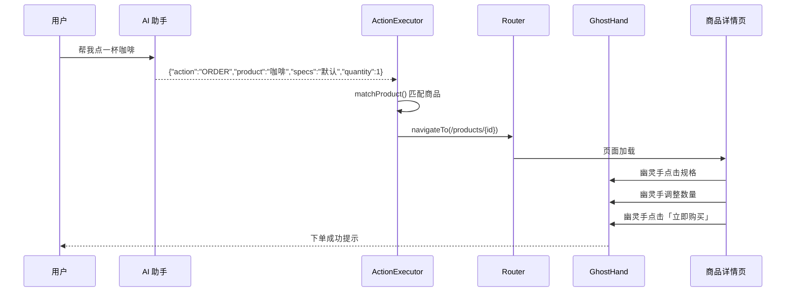

# AI 饮品助手开发文档

## 1. 功能概述

全局悬浮 AI 助手，点击右下角按钮打开对话面板，通过 Dify API 进行流式对话。当用户发送特定指令（如「帮我点一杯咖啡」）时，AI 会返回结构化 JSON 指令，前端解析后展示指令卡片。**页面跳转与幽灵手模拟点击为后续开发内容，当前仅做解析与展示。**

---

## 2. 技术架构

```
用户浏览器                    Nuxt 服务端                    Dify Cloud
┌──────────────┐    POST     ┌──────────────┐    POST      ┌──────────────┐
│ AiChatWidget │ ──────────> │ /api/ai/chat │ ──────────>  │ /v1/chat-    │
│ useAiChat    │ <── SSE ─── │ (流式代理)    │ <── SSE ───  │  messages    │
└──────────────┘             └──────────────┘              └──────────────┘
```

### 2.1 相关文件

| 文件                              | 说明                                    |
| --------------------------------- | --------------------------------------- |
| `app/components/AiChatWidget.vue` | 悬浮按钮 + 对话面板 UI                  |
| `app/composables/useAiChat.ts`    | 对话状态管理、SSE 解析、指令 JSON 提取  |
| `server/api/ai/chat.post.ts`      | Dify API 流式代理（API Key 仅存服务端） |
| `server/utils/config.ts`          | 从数据库读取系统配置（含 Dify API Key） |
| `server/sql/system_configs.sql`   | 系统配置表结构与初始数据                |
| `nuxt.config.ts`                  | `difyApiBase` 运行时配置                |

### 2.2 环境配置

Dify API Key 存储在 MySQL `system_configs` 表中，不再写入代码仓库。首次部署执行 `server/sql/system_configs.sql` 初始化，后续可直接在数据库更新：

```sql
UPDATE system_configs SET config_value = '你的新Key' WHERE config_key = 'dify_api_key';
```

也可通过环境变量 `DIFY_API_KEY` 作为备用（数据库无值时生效）。

---

## 3. Dify API 对接说明

### 3.1 请求

- **地址**：`https://api.dify.ai/v1/chat-messages`
- **方式**：`POST`
- **认证**：`Authorization: Bearer {API_KEY}`
- **默认模式**：`response_mode: "streaming"`（SSE 流式）

请求体示例：

```json
{
  "inputs": {},
  "query": "帮我点一杯咖啡",
  "response_mode": "streaming",
  "user": "nuxt-interaction-user",
  "conversation_id": ""
}
```

### 3.2 流式响应解析

SSE 每行格式为 `data: {JSON}\n\n`，主要关注以下事件：

| event           | 说明                                  |
| --------------- | ------------------------------------- |
| `message`       | 增量文本，`answer` 字段为本次增量内容 |
| `agent_message` | Agent 模式增量文本                    |
| `message_end`   | 消息结束，可获取 `conversation_id`    |
| `error`         | 错误信息                              |

前端在 `useAiChat.ts` 中累积 `answer` 字段实现打字机效果。

---

## 4. 指令 JSON 协议（后续自动化核心）

当用户输入下单类指令时，Dify 应用应配置为返回如下 JSON 格式（可在 Dify 工作流/提示词中约束）：

```json
{
  "action": "ORDER",
  "product": "可乐",
  "specs": "加冰"
}
```

### 4.1 字段说明

| 字段        | 类型   | 必填 | 说明                                       |
| ----------- | ------ | ---- | ------------------------------------------ |
| `action`    | string | 是   | 操作类型，如 `ORDER`、`NAVIGATE`、`SEARCH` |
| `product`   | string | 否   | 商品名称，用于匹配 `products` 表           |
| `specs`     | string | 否   | 规格描述，如「加冰」「大杯」               |
| `productId` | number | 否   | 直接指定商品 ID（优先级高于名称匹配）      |
| `route`     | string | 否   | 目标页面路由，如 `/products/4`             |

### 4.2 前端解析与清洗

`useAiChat.ts` 提供以下工具函数：

| 函数                    | 说明                                                |
| ----------------------- | --------------------------------------------------- |
| `stripThinkingTags()`   | 剥离 `` 思考块                                      |
| `parseAiAction()`       | 从清洗后文本提取指令 JSON                           |
| `sanitizeAiResponse()`  | 统一清洗：去思考块 → 解析指令 → 生成友好展示文案    |
| `formatActionMessage()` | 将 `ORDER` 等指令转为「好的，已为您准备下单：咖啡」 |

**思考块处理**：部分模型会在回复前输出 ``包裹的推理过程。前端在流式过程中实时调用`sanitizeAiResponse()`，确保思考内容不展示在气泡中（可选通过「思考过程」折叠面板查看）。

**纯 JSON 回复**：当 AI 仅返回 `{"action":"ORDER","product":"咖啡","specs":""}` 时，气泡展示友好文案而非原始 JSON，指令详情在下方「检测到操作指令」卡片中展示。

解析流程：

1. `stripThinkingTags()` 移除思考块
2. 整段文本为 JSON → 直接解析
3. 文本中包含 `{..."action"...}` 块 → 正则提取后解析
4. 解析成功且含 `action` 字段 → 挂载到消息的 `action` 属性

---

## 5. 自动下单 + 幽灵手模拟点击

> **当前状态：已实现 v0.2**

### 5.1 完整流程



### 5.2 已实现模块

| 文件                                   | 说明                                        |
| -------------------------------------- | ------------------------------------------- |
| `app/stores/orderAutomation.ts`        | Pinia 存储待执行的下单任务                  |
| `app/composables/useActionExecutor.ts` | 指令分发、商品匹配、页面跳转                |
| `app/composables/useGhostHand.ts`      | 虚拟光标移动 + GSAP 动画 + 模拟点击         |
| `app/pages/products/[id].vue`          | `data-ghost-target` 标记 + `runAutoOrder()` |

### 5.3 指令 JSON 协议（含 quantity）

```json
{
  "action": "ORDER",
  "product": "咖啡",
  "specs": "默认",
  "quantity": 1
}
```

| 字段        | 说明                                                            |
| ----------- | --------------------------------------------------------------- |
| `action`    | `ORDER` / `NAVIGATE` / `SEARCH`                                 |
| `product`   | 商品名或品类关键词（如「咖啡」匹配咖啡类销量最高商品）          |
| `productId` | 可选，直接指定商品 ID（优先级最高）                             |
| `specs`     | 规格，`默认` 或 `标准` 取第一项；也可填「大杯」等关键词模糊匹配 |
| `quantity`  | 数量，默认 1                                                    |
| `route`     | `NAVIGATE` 时目标路由                                           |

### 5.4 商品匹配逻辑

1. `productId` 直接命中
2. 商品名完全匹配
3. 商品名包含关键词（多个时取销量最高）
4. 品类关键词映射（咖啡→coffee、可乐→soda 等）
5. `categoryName` 模糊匹配

### 5.5 幽灵手元素标记

```html
<button data-ghost-target="spec-0">中杯 350ml</button>
<button data-ghost-target="quantity-plus">+</button>
<button data-ghost-target="buy-now">立即购买</button>
```

### 5.6 接入点

`useAiChat.ts` 在流式响应结束后自动调用：

```typescript
if (import.meta.client && final.action) {
  const { execute } = useActionExecutor();
  setTimeout(() => execute(final.action!), 600);
}
```

---

## 6. 商品数据库

模拟商品数据已写入 `server/sql/products.sql`，导入方式：

```bash
mysql -u root -p nuxt_interaction < server/sql/products.sql
```

表结构 `products` 包含名称、分类、价格、规格（JSON）、配料（JSON）等字段，共 12 条饮品数据。

后续可将 `server/api/products/` 接口改为从数据库读取，替代当前的 `server/data/products.ts` 内存数据。

---

## 7. Dify 应用配置建议

在 Dify 控制台中建议配置：

1. **系统提示词**：说明你是饮品商城助手，当用户要求下单时，只返回 JSON 指令，不要多余文字
2. **触发示例**：用户说「帮我点一杯咖啡」→ 返回 `{"action":"ORDER","product":"可乐","specs":"加冰"}`
3. **知识库**（可选）：导入 `products.sql` 中的商品信息，让 AI 了解可售商品

---

## 8. 测试清单

- [ ] 点击悬浮按钮，面板正常打开/关闭
- [ ] 发送普通消息，流式打字效果正常
- [ ] 发送「帮我点一杯咖啡」，自动跳转商品页并完成幽灵手下单
- [ ] 指令含 `quantity: 2` 时数量正确递增
- [ ] `specs: "大杯"` 时选中对应规格
- [ ] 多轮对话 `conversation_id` 保持连续
- [ ] 清空对话后重新开始新会话
- [ ] 移动端面板宽度自适应

---

## 9. 版本记录

| 版本 | 日期       | 说明                                        |
| ---- | ---------- | ------------------------------------------- |
| v0.1 | 2026-07-01 | 悬浮窗 + Dify 流式对话 + 指令 JSON 解析展示 |
| v0.2 | 2026-07-01 | 自动下单 + 幽灵手模拟点击 + 商品匹配        |
| v0.3 | 2026-07-01 | 规格/库存校验 + 支付页 + 数据库真实库存     |

第三阶段,

1. 规格和数量校验,规格不符或数量不足需提示
2. 点击立即购买,跳转支付页并提示用户是否确认支付和密码等信息
3. 商品数量改为真实数据

### 5.7 规格与库存校验（v0.3）

| 场景         | 行为                                                      |
| ------------ | --------------------------------------------------------- |
| 规格不匹配   | `findSpecMatch()` 返回 `matched: false`，提示可选规格列表 |
| 库存为 0     | 提示「商品已售罄」，终止自动下单                          |
| 数量超过库存 | 提示「库存不足，当前仅剩 N 件」，终止自动下单             |

校验在 `executeOrder()`（跳转前）和 `runAutoOrder()`（幽灵手操作前）双重执行。

### 5.8 支付流程（v0.3）

点击「立即购买」后跳转 `/payment?productId=&specIndex=&quantity=`：

1. 展示订单摘要（商品、规格、数量、合计）
2. AI 自动下单时显示提示横幅，并弹出确认消息
3. 用户勾选「确认支付」并输入 6 位以上支付密码
4. 调用 `POST /api/orders/checkout` 扣减库存并完成支付

### 5.9 真实库存数据（v0.3）

`server/utils/products.ts` 优先从 MySQL `products` 表读取商品与库存，数据库不可用时回退 `server/data/products.ts` 内存数据。支付成功后库存与销量同步更新。

---

---
## 10. 第四阶段：后台管理 AI 自动化

### 10.1 架构设计

Dify 工作流采用**意图路由 + 分流处理**模式：

```
用户输入
  │
  ▼
┌──────────────────┐
│  意图分类器       │  ← 判断是「订单需求」还是「后台管理需求」
└──────┬───────────┘
       │
       ├── 订单需求 ──▶ Prompt A（ORDER 提示词，已有）
       │
       └── 管理需求 ──▶ Prompt B（后台管理提示词，见下方）
                             │
                             ▼
                    useActionExecutor 分派：
                      PRODUCT_CREATE   → POST /api/products
                      PRODUCT_UPDATE   → PUT /api/products/{id}
                      PRODUCT_DELETE   → DELETE /api/products/{id}
                      PRODUCT_SEARCH   → navigateTo 商品管理页
                      MAP_ADD_ADDRESS  → POST /api/addresses
                      MAP_UPDATE_ADDRESS → PUT /api/addresses/{id}
                      MAP_DELETE_ADDRESS → DELETE /api/addresses/{id}
                      MAP_SEARCH_LOCATION → navigateTo 地图页
                      MAP_LIST_ADDRESSES → navigateTo 地图页
```

### 10.2 代码与 Action 对应关系

| action | 代码位置 | 核心字段 |
|--------|----------|----------|
| `PRODUCT_CREATE` | `useActionExecutor.ts:138` | name, category, price, description, image, specs, tags, stock, rating |
| `PRODUCT_UPDATE` | `useActionExecutor.ts:181` | productId(或product), changes{...} |
| `PRODUCT_DELETE` | `useActionExecutor.ts:234` | productId(或product), productName |
| `PRODUCT_SEARCH` | `useActionExecutor.ts:268` | keyword, category |
| `MAP_ADD_ADDRESS` | `useActionExecutor.ts:280` | address, lng, lat |
| `MAP_UPDATE_ADDRESS` | `useActionExecutor.ts:310` | addressId, address, lng, lat |
| `MAP_DELETE_ADDRESS` | `useActionExecutor.ts:326` | addressId |
| `MAP_SEARCH_LOCATION` | `useActionExecutor.ts:345` | keyword, city |
| `MAP_LIST_ADDRESSES` | `useActionExecutor.ts:355` | （无必填字段） |

**关键代码行为说明（编写 Prompt 时必须对齐）：**

1. **分类字段** — `category` 必须用英文 key（`coffee`/`tea`/`juice`/`soda`/`milk`），前端自动通过 `getCategoryName()` 转为中文
2. **规格字段** — `specs` 是数组 `[{“size”:”规格名”,”price”:数字}]`，非字符串；若用户未指定，默认为 `[{“size”:”默认”,”price”:<商品价格>}]`
3. **更新操作** — `productId` 和 `product`（名称）二选一即可；`changes` 对象仅包含要修改的字段，前端会先拉取当前数据再合并
4. **删除操作** — `productId` 和 `product`（名称）二选一，前端通过 `matchProduct()` 模糊匹配后弹出确认框
5. **地图坐标** — 没有坐标时不应使用 `MAP_ADD_ADDRESS`，应使用 `MAP_SEARCH_LOCATION` 跳转地图页搜索
6. **所有数字字段** — price/lng/lat/stock/quantity 必须是可以被 `Number()` 解析的合法数字

### 10.3 后台管理 Prompt（配置在 Dify 管理分支中）

```
# Role
你是一个纯粹的”意图识别与数据转换网关”，负责将管理员的自然语言指令转化为前端系统可执行的结构化 JSON 数据。

# Rules (绝对死命令)
1. 你的输出将直接作为代码被系统解析，因此你【绝对不能】输出任何聊天、客套话、解释或 Markdown 的 ```json 标记。
2. 你的输出内容【必须有且仅有】一个合法的 JSON 字符串，不能有换行。
3. 分类（category）必须使用英文 key：coffee（咖啡）、tea（茶饮）、juice（果汁）、soda（汽水）、milk（奶茶）。
4. 所有价格、坐标、库存字段必须是纯数字，不能被引号包裹。
5. 规格（specs）是数组格式，每项含 size（规格名）和 price（价格）。如果用户没有指定规格，默认生成 [{“size”:”默认”,”price”:<商品价格>}]。
6. 更新操作只传需要修改的字段到 changes 对象中，不要传全部字段。
7. 地图标注无需用户提供经纬度或地址 ID —— 只需提供地址名称，前端会自动调用地理编码服务获取坐标，或通过名称模糊匹配找到已有地址。

# Output Format (严格输出格式)

## 商品管理
{“action”: “PRODUCT_CREATE”, “name”: “商品名”, “category”: “分类key”, “price”: 数字, “description”: “描述”, “image”: “emoji图标”, “specs”: [{“size”: “规格名”, “price”: 数字}], “tags”: [“标签1”], “stock”: 数字, “rating”: 数字}
{“action”: “PRODUCT_UPDATE”, “productId”: 数字, “changes”: {“price”: 新价格}}
{“action”: “PRODUCT_UPDATE”, “product”: “商品名”, “changes”: {“stock”: 新库存, “price”: 新价格}}
{“action”: “PRODUCT_DELETE”, “productId”: 数字}
{“action”: “PRODUCT_DELETE”, “product”: “商品名”}
{“action”: “PRODUCT_SEARCH”, “keyword”: “关键词”, “category”: “分类key”}
{“action”: “PRODUCT_SEARCH”, “category”: “分类key”}

## 地图标注
{“action”: “MAP_ADD_ADDRESS”, “address”: “地址描述”}
{“action”: “MAP_UPDATE_ADDRESS”, “address”: “原地址名”, “newAddress”: “新地址名”}
{“action”: “MAP_DELETE_ADDRESS”, “address”: “地址名称”}
{“action”: “MAP_SEARCH_LOCATION”, “keyword”: “地点名”, “city”: “城市名”}
{“action”: “MAP_LIST_ADDRESSES”}

# Few-Shot Examples (少样本学习)

## 商品创建
用户输入: 添加商品：抹茶拿铁，分类茶饮，价格28元，日式抹茶与牛奶的完美融合
系统输出: {“action”: “PRODUCT_CREATE”, “name”: “抹茶拿铁”, “category”: “tea”, “price”: 28, “description”: “日式抹茶与牛奶的完美融合”, “image”: “🍵”, “specs”: [{“size”: “默认”, “price”: 28}], “tags”: [“抹茶”, “拿铁”], “stock”: 0, “rating”: 5}

用户输入: 创建一个新品：冰美式，咖啡类，18元，描述是”冰爽美式咖啡”，图标🧊，中杯15大杯20，标签冰饮、咖啡
系统输出: {“action”: “PRODUCT_CREATE”, “name”: “冰美式”, “category”: “coffee”, “price”: 18, “description”: “冰爽美式咖啡”, “image”: “🧊”, “specs”: [{“size”: “中杯”, “price”: 15}, {“size”: “大杯”, “price”: 20}], “tags”: [“冰饮”, “咖啡”], “stock”: 0, “rating”: 5}

## 商品更新
用户输入: 把美式咖啡的价格改为25元
系统输出: {“action”: “PRODUCT_UPDATE”, “product”: “美式咖啡”, “changes”: {“price”: 25}}

用户输入: 更新商品ID为3的商品，库存改为200，价格改为30
系统输出: {“action”: “PRODUCT_UPDATE”, “productId”: 3, “changes”: {“stock”: 200, “price”: 30}}

用户输入: 把可乐的标签加上”碳酸”和”经典”
系统输出: {“action”: “PRODUCT_UPDATE”, “product”: “可乐”, “changes”: {“tags”: [“碳酸”, “经典”]}}

## 商品删除
用户输入: 删除美式咖啡
系统输出: {“action”: “PRODUCT_DELETE”, “product”: “美式咖啡”}

用户输入: 删除ID为5的商品
系统输出: {“action”: “PRODUCT_DELETE”, “productId”: 5}

## 商品搜索
用户输入: 查看所有咖啡类商品
系统输出: {“action”: “PRODUCT_SEARCH”, “category”: “coffee”}

用户输入: 搜索抹茶
系统输出: {“action”: “PRODUCT_SEARCH”, “keyword”: “抹茶”}

用户输入: 看看茶饮分类下有没有抹茶相关的
系统输出: {“action”: “PRODUCT_SEARCH”, “category”: “tea”, “keyword”: “抹茶”}

## 地图标注（新增 → 前端自动搜索+保存，无需经纬度）
用户输入: 标注地址：上海市南京路步行街
系统输出: {“action”: “MAP_ADD_ADDRESS”, “address”: “上海市南京路步行街”}

用户输入: 帮我添加一个北京天安门的标注
系统输出: {“action”: “MAP_ADD_ADDRESS”, “address”: “北京天安门”}

用户输入: 在地图上标注一下东方明珠
系统输出: {“action”: “MAP_ADD_ADDRESS”, “address”: “东方明珠”}

## 地图搜索
用户输入: 在地图上找一下北京天安门
系统输出: {“action”: “MAP_SEARCH_LOCATION”, “keyword”: “北京天安门”, “city”: “北京”}

用户输入: 搜索上海的东方明珠
系统输出: {“action”: “MAP_SEARCH_LOCATION”, “keyword”: “东方明珠”, “city”: “上海”}

## 地图标注更新/删除（前端按名称模糊匹配 → 直接调 API）
用户输入: 把北京天安门的标注改成天安门广场
系统输出: {“action”: “MAP_UPDATE_ADDRESS”, “address”: “北京天安门”, “newAddress”: “天安门广场”}

用户输入: 删除南京路步行街的标注
系统输出: {“action”: “MAP_DELETE_ADDRESS”, “address”: “南京路步行街”}

用户输入: 查看所有标注
系统输出: {“action”: “MAP_LIST_ADDRESSES”}

# Exception Handling (防御性边界)
- 如果用户输入与商品管理、地图标注均无关，严格输出：
{“action”: “NONE”}
- 如果创建商品时缺少名称或分类等必要字段，仍尽力输出已有信息，缺失字段由前端校验提示
- 如果用户只说”更新商品”但未指明哪个商品/修改什么，不要凭空编造
```

### 10.4 前端消费流程

```
sanitizeAiResponse(rawText)
  │ stripThinkingTags() 去思考块
  │ parseAiAction() 正则提取 JSON → AiAction
  │ formatActionMessage() 生成友好文案展示在气泡中
  ▼
useActionExecutor().execute(action)
  │ switch(action.action)
  │   PRODUCT_CREATE   → 校验字段 → POST /api/products → ElMessage
  │   PRODUCT_UPDATE   → matchProduct() → 拉取当前数据 → 合并 changes → PUT → ElMessage
  │   PRODUCT_DELETE   → matchProduct() → ElMessageBox.confirm → DELETE → ElMessage
  │   PRODUCT_SEARCH   → navigateTo(/dashboard/manage-products?keyword=&category=)
  │   MAP_ADD_ADDRESS  → 校验坐标 → POST /api/addresses 或 无坐标时跳转地图
  │   MAP_UPDATE_ADDRESS → PUT /api/addresses/{id}
  │   MAP_DELETE_ADDRESS → ElMessageBox.confirm → DELETE /api/addresses/{id}
  │   MAP_SEARCH_LOCATION → navigateTo(/dashboard/map?searchKeyword=&searchCity=)
  │   MAP_LIST_ADDRESSES → navigateTo(/dashboard/map)
  ▼
操作完成，ElMessage 反馈结果
```

### 10.5 涉及文件

| 文件 | 说明 |
|------|------|
| `app/composables/useAiChat.ts` | `formatActionMessage` 新增 9 种管理 action 文案；`sendMessage` 支持 `inputs` 参数 |
| `app/composables/useActionExecutor.ts` | 管理端操作改为设置自动化任务 + 跳转页面，由幽灵手执行（不再直接调 API） |
| `app/composables/useGhostHand.ts` | 新增 `fillInput`、`fillNumberInput`、`selectOption`、`waitForSelector` 表单操作能力 |
| `app/composables/useAdminAutomation.ts` | **新增** — 管理端幽灵手自动化编排（创建/更新/删除/搜索全流程） |
| `app/stores/adminAutomation.ts` | **新增** — 管理端自动化任务状态管理（`useAdminAutomationStore`） |
| `app/pages/dashboard/index.vue` | 后台聊天面板，传递 `{context:'admin'}` 上下文给 Dify |
| `app/pages/dashboard/manage-products.vue` | 添加全部 `data-ghost-target` 标记 + `onMounted` 触发自动化任务 |
| `app/pages/dashboard/map.vue` | 支持 URL 参数 `searchKeyword`/`searchCity` 自动搜索 |
| `server/api/ai/chat.post.ts` | 透传 `inputs` 到 Dify，无需修改 |

### 10.6 幽灵手自动化流程

```
用户输入 "添加商品抹茶拿铁，28元，茶饮"
  │
  ▼
Dify → {"action":"PRODUCT_CREATE","name":"抹茶拿铁","category":"tea","price":28,...}
  │
  ▼
useActionExecutor.execute()
  │ executeProductCreate() → useAdminAutomationStore.setTask({type:'PRODUCT_CREATE',data:{...}})
  │ navigateTo('/dashboard/manage-products')
  ▼
manage-products.vue onMounted
  │ 检测到 adminStore.task.status === 'pending'
  │ 调用 useAdminAutomation().run()
  ▼
幽灵手执行序列：
  1. 点击 [data-ghost-target="btn-create"]         → 弹出新增对话框
  2. fillInput('[data-ghost-target="form-name"]', '抹茶拿铁')
  3. selectOption('[data-ghost-target="form-category"]', '茶饮')
  4. fillNumberInput('[data-ghost-target="form-price"]', 28)
  5. fillInput('[data-ghost-target="form-description"]', '...')
  6. ... (填写其他字段)
  7. 点击 [data-ghost-target="btn-save"]           → 提交保存
  │
  ▼
ElMessage.success('商品「抹茶拿铁」创建完成')
adminStore.clear()
```

### 10.7 Ghost Target 标记清单

| 标记 | 位置 | 用途 |
|------|------|------|
| `btn-create` | 新增商品按钮 | 打开创建对话框 |
| `search-category` | 筛选分类下拉 | 分类筛选 |
| `search-keyword` | 搜索关键词输入 | 关键词输入 |
| `btn-search` | 查询按钮 | 触发搜索 |
| `edit-{id}` | 表格行编辑按钮 | 打开编辑对话框 |
| `delete-{id}` | 表格行删除按钮 | 触发删除 |
| `form-name` | 名称输入框 | 商品名称 |
| `form-category` | 分类下拉 | 商品分类 |
| `form-image` | 图标输入 | 商品图标 |
| `form-price` | 售价输入 | 默认售价 |
| `form-original-price` | 原价输入 | 原价 |
| `form-description` | 描述文本框 | 商品描述 |
| `form-rating` | 评分输入 | 评分 |
| `form-stock` | 库存输入 | 库存数量 |
| `form-sales` | 销量输入 | 销量 |
| `form-tags` | 标签选择器 | 标签 |
| `form-ingredients` | 配料选择器 | 配料 |
| `spec-size-{i}` | 规格名称输入 | 第 i 个规格名称 |
| `spec-price-{i}` | 规格价格输入 | 第 i 个规格价格 |
| `btn-add-spec` | 添加规格按钮 | 追加规格行 |
| `btn-save` | 保存按钮 | 提交表单 |
| `btn-cancel` | 取消按钮 | 关闭对话框 |
