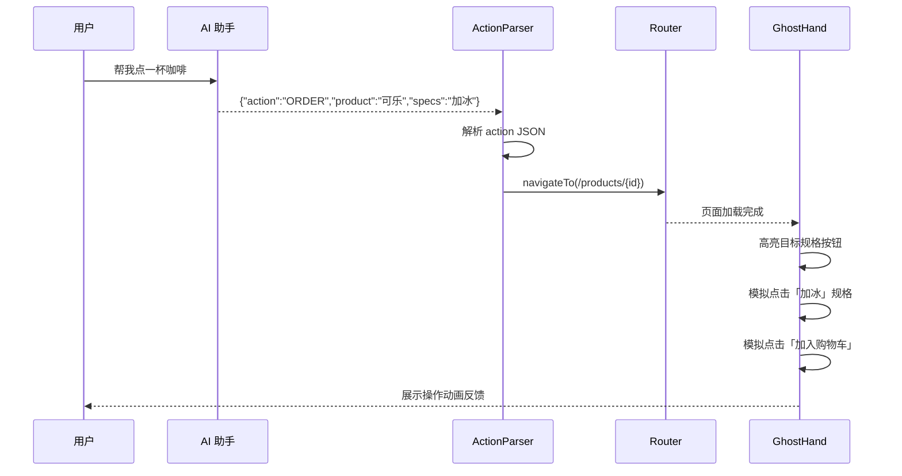

# AI 饮品助手开发文档

## 1. 功能概述

全局悬浮 AI 助手，点击右下角按钮打开对话面板，通过 Dify API 进行流式对话。当用户发送特定指令（如「帮我点一杯咖啡」）时，AI 会返回结构化 JSON 指令，前端解析后展示指令卡片。**页面跳转与幽灵手模拟点击为后续开发内容，当前仅做解析与展示。**

---

## 2. 技术架构

```
用户浏览器                    Nuxt 服务端                    Dify Cloud
┌──────────────┐    POST     ┌──────────────┐    POST      ┌──────────────┐
│ AiChatWidget │ ──────────> │ /api/ai/chat │ ──────────>  │ /v1/chat-    │
│ useAiChat    │ <── SSE ─── │ (流式代理)    │ <── SSE ───  │  messages    │
└──────────────┘             └──────────────┘              └──────────────┘
```

### 2.1 相关文件

| 文件 | 说明 |
|------|------|
| `app/components/AiChatWidget.vue` | 悬浮按钮 + 对话面板 UI |
| `app/composables/useAiChat.ts` | 对话状态管理、SSE 解析、指令 JSON 提取 |
| `server/api/ai/chat.post.ts` | Dify API 流式代理（API Key 仅存服务端） |
| `nuxt.config.ts` | `difyApiKey`、`difyApiBase` 运行时配置 |

### 2.2 环境配置

API Key 默认写在 `nuxt.config.ts` 的 `runtimeConfig.difyApiKey`，生产环境建议通过环境变量覆盖：

```bash
# .env
DIFY_API_KEY=app-F3VCgpqjGCoWKXMu22vAEL2f
```

---

## 3. Dify API 对接说明

### 3.1 请求

- **地址**：`https://api.dify.ai/v1/chat-messages`
- **方式**：`POST`
- **认证**：`Authorization: Bearer {API_KEY}`
- **默认模式**：`response_mode: "streaming"`（SSE 流式）

请求体示例：

```json
{
  "inputs": {},
  "query": "帮我点一杯咖啡",
  "response_mode": "streaming",
  "user": "nuxt-interaction-user",
  "conversation_id": ""
}
```

### 3.2 流式响应解析

SSE 每行格式为 `data: {JSON}\n\n`，主要关注以下事件：

| event | 说明 |
|-------|------|
| `message` | 增量文本，`answer` 字段为本次增量内容 |
| `agent_message` | Agent 模式增量文本 |
| `message_end` | 消息结束，可获取 `conversation_id` |
| `error` | 错误信息 |

前端在 `useAiChat.ts` 中累积 `answer` 字段实现打字机效果。

---

## 4. 指令 JSON 协议（后续自动化核心）

当用户输入下单类指令时，Dify 应用应配置为返回如下 JSON 格式（可在 Dify 工作流/提示词中约束）：

```json
{
  "action": "ORDER",
  "product": "可乐",
  "specs": "加冰"
}
```

### 4.1 字段说明

| 字段 | 类型 | 必填 | 说明 |
|------|------|------|------|
| `action` | string | 是 | 操作类型，如 `ORDER`、`NAVIGATE`、`SEARCH` |
| `product` | string | 否 | 商品名称，用于匹配 `products` 表 |
| `specs` | string | 否 | 规格描述，如「加冰」「大杯」 |
| `productId` | number | 否 | 直接指定商品 ID（优先级高于名称匹配） |
| `route` | string | 否 | 目标页面路由，如 `/products/4` |

### 4.2 前端解析与清洗

`useAiChat.ts` 提供以下工具函数：

| 函数 | 说明 |
|------|------|
| `stripThinkingTags()` | 剥离 `` 思考块 |
| `parseAiAction()` | 从清洗后文本提取指令 JSON |
| `sanitizeAiResponse()` | 统一清洗：去思考块 → 解析指令 → 生成友好展示文案 |
| `formatActionMessage()` | 将 `ORDER` 等指令转为「好的，已为您准备下单：咖啡」 |

**思考块处理**：部分模型会在回复前输出 `` 包裹的推理过程。前端在流式过程中实时调用 `sanitizeAiResponse()`，确保思考内容不展示在气泡中（可选通过「思考过程」折叠面板查看）。

**纯 JSON 回复**：当 AI 仅返回 `{"action":"ORDER","product":"咖啡","specs":""}` 时，气泡展示友好文案而非原始 JSON，指令详情在下方「检测到操作指令」卡片中展示。

解析流程：

1. `stripThinkingTags()` 移除思考块
2. 整段文本为 JSON → 直接解析
3. 文本中包含 `{..."action"...}` 块 → 正则提取后解析
4. 解析成功且含 `action` 字段 → 挂载到消息的 `action` 属性

---

## 5. 后续开发：页面跳转 + 幽灵手模拟点击

> **当前状态：未实现，仅记录方案。**

### 5.1 目标流程



### 5.2 建议实现模块

#### `app/composables/useActionExecutor.ts`（待开发）

```typescript
interface ActionExecutor {
  execute(action: AiAction): Promise<void>
}
```

职责：
- 根据 `action` 类型分发处理逻辑
- `ORDER`：查商品 → 跳转详情页 → 触发幽灵手
- `NAVIGATE`：直接 `navigateTo(action.route)`
- `SEARCH`：跳转商品列表并带关键词参数

#### `app/composables/useGhostHand.ts`（待开发）

职责：
- 在页面上创建虚拟光标元素
- 通过 `data-ghost-target` 属性标记可点击目标
- 使用 GSAP 动画移动光标到目标位置并模拟 click
- 操作步骤队列化，逐步执行

#### 页面元素标记规范（待开发）

在商品详情页等关键按钮上添加 `data-ghost-target` 属性：

```html
<button data-ghost-target="spec-加冰">加冰</button>
<button data-ghost-target="add-cart">加入购物车</button>
```

幽灵手根据 `action.specs` 匹配 `data-ghost-target` 值进行点击。

### 5.3 商品匹配逻辑

1. 优先使用 `action.productId`
2. 否则按 `action.product` 名称模糊匹配 `products` 表 / API
3. 匹配失败时 AI 助手提示用户重新选择

### 5.4 接入点

在 `useAiChat.ts` 的 `sendMessage` 完成后，当 `assistantMsg.action` 存在时调用：

```typescript
// 后续开发时取消注释
// const executor = useActionExecutor()
// if (assistantMsg.action) {
//   await executor.execute(assistantMsg.action)
// }
```

---

## 6. 商品数据库

模拟商品数据已写入 `server/sql/products.sql`，导入方式：

```bash
mysql -u root -p nuxt_interaction < server/sql/products.sql
```

表结构 `products` 包含名称、分类、价格、规格（JSON）、配料（JSON）等字段，共 12 条饮品数据。

后续可将 `server/api/products/` 接口改为从数据库读取，替代当前的 `server/data/products.ts` 内存数据。

---

## 7. Dify 应用配置建议

在 Dify 控制台中建议配置：

1. **系统提示词**：说明你是饮品商城助手，当用户要求下单时，只返回 JSON 指令，不要多余文字
2. **触发示例**：用户说「帮我点一杯咖啡」→ 返回 `{"action":"ORDER","product":"可乐","specs":"加冰"}`
3. **知识库**（可选）：导入 `products.sql` 中的商品信息，让 AI 了解可售商品

---

## 8. 测试清单

- [ ] 点击悬浮按钮，面板正常打开/关闭
- [ ] 发送普通消息，流式打字效果正常
- [ ] 发送「帮我点一杯咖啡」，返回 JSON 指令并展示指令卡片
- [ ] 多轮对话 `conversation_id` 保持连续
- [ ] 清空对话后重新开始新会话
- [ ] 移动端面板宽度自适应

---

## 9. 版本记录

| 版本 | 日期 | 说明 |
|------|------|------|
| v0.1 | 2026-07-01 | 悬浮窗 + Dify 流式对话 + 指令 JSON 解析展示 |
| v0.2 | 待定 | 页面跳转 + 幽灵手模拟点击自动化 |
